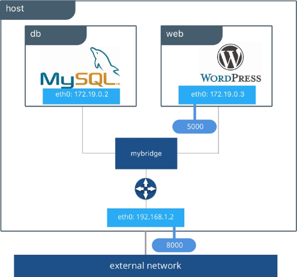

# Projet NF19

Ceci est notre architecture docker dans le cadre du projet [NF19](https://moodle.utt.fr/course/view.php?id=1508).  
Elle est composée :
 - d'une base de données MySQL masquée du réseau externe
 - de WordPress accessible via le port 8000

  
_Les IPs ne sont là qu'à titre d'exemple_

## Lancement des conteneurs
L'architecture est entièrement orchestrée via docker-compose et la structure est visible dans `docker-compose.yml`.  
Pour lancer les conteneurs :
1. Si ce n'est pas déjà fait, installez [docker-compose](https://docs.docker.com/compose/install/)
2. Cloner le projet avec la commande `git clone https://github.com/koeltv/NF19_Project.git` ou en téléchargeant le .zip du dépôt
3. Placez-vous à la racine du projet
4. Lancer la commande `docker-compose up` (vous pouvez rajouter l'option `-d` pour le détacher de la console)
5. C'est tout ! Le site WordPress est accessible sur la machine hôte via l'adresse [http://localhost:8000](http://localhost:8000)

Pour vous connecter en tant qu'administrateur sur votre site WordPress, rajoutez `/wp-admin` à la fin de l'URL comme ceci: [http://localhost:8000/wp-admin](http://localhost:8000/wp-admin)  
Si vous réutilisez la configuration que nous avons créée, le login est `NF19Admin` et le mot de passe est `Ntr)XzE5KG$YjjZssq`
